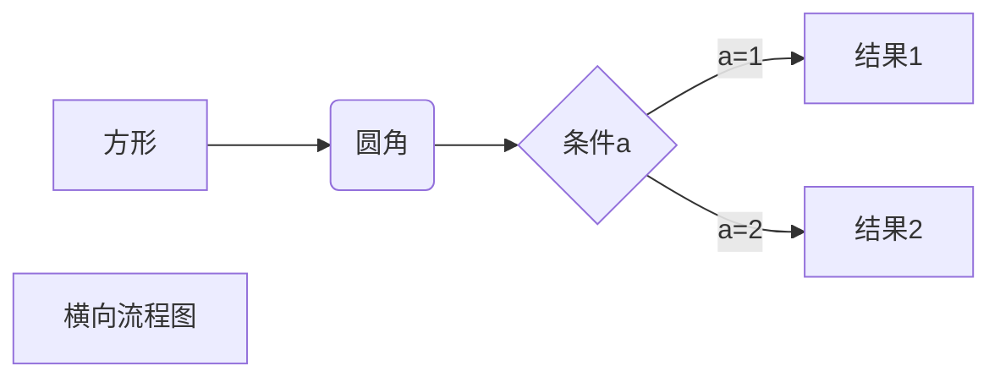
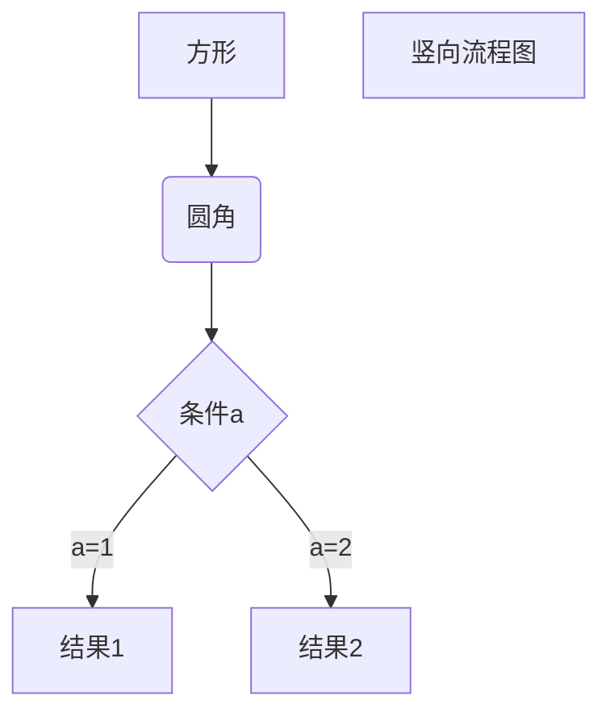
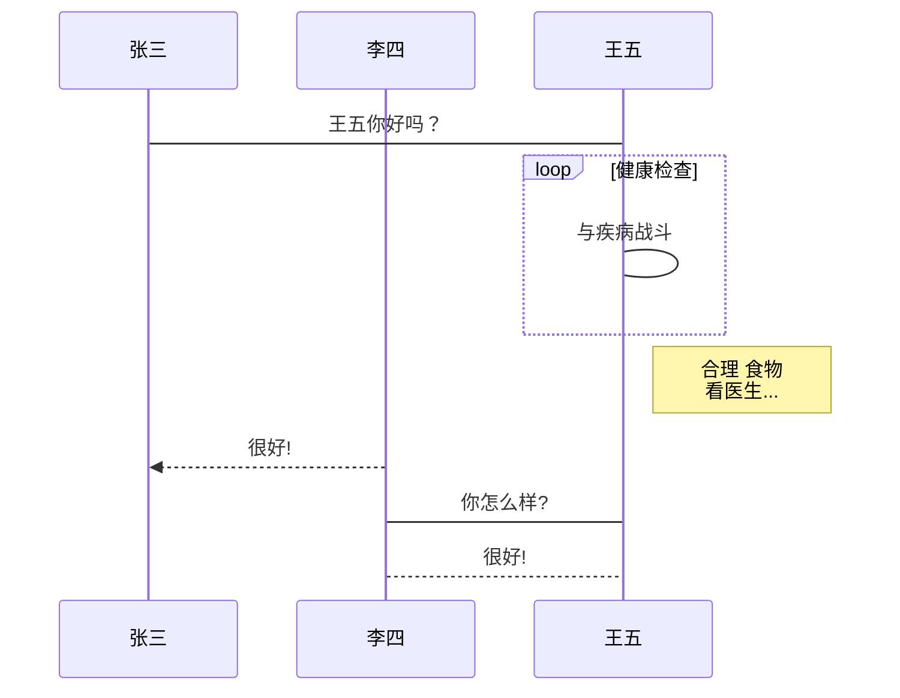
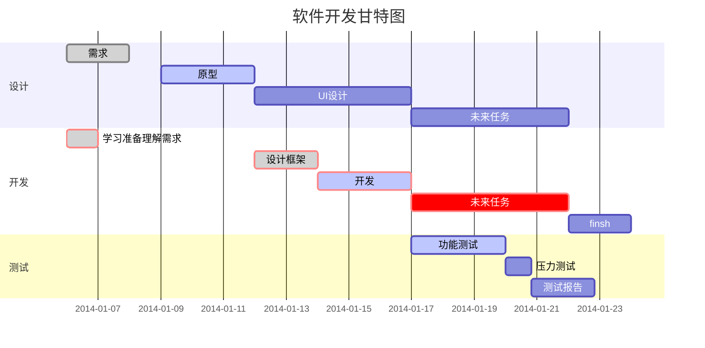

声明量的管理，github会把多个空格显示为1个空格。

自然段落  
```java
自然段落  
自然段落
空格警告！
```
```java
自然段落

自然段落
```
# h1
## h2
###### h6
```java
# h1
## h2
###### h6
空格警告！
```
引用缩进顺位继承，每次4个空格或1个制表符
>引用
>>引用中的引用。
列表缩进顺位继承，每次4个空格或1个制表符。
- Red
- Green
- 空格警告！
- 退出条列：换行，删除，（换行）。

1. Bird
2. McHale
3. 空格警告！

行首出现数字-英语句点-空白，要避免这样的状况，在句点前面加上反斜杠：  
1986\. What a great year.  
分隔线，不要有别的字符。  

* * *
***
*****
- - -
----------
___
```java
* * *
***
*****
- - -
----------
___
```
强调，标记内部不能有空格。  
**强调**  
__强调__  
~~删除线~~  
*倾斜*  
```java
**强调**
__强调__
~~删除线~~ 
*倾斜*
```
linein code `linein code`.

```java
linein code `linein code`.
```


```java


               
```
这里有[^114514]红茶。

[^114514]: 一种产自日本的红茶。

```java
这里有[^114514]红茶。
驻留式注解。
[^114514]: 一种产自日本的红茶。
```
words[^1] which have footer explain texts.

[^1]: There are footer explain texts.

```java
words[^1] which have footer explain texts.
只github无效。
[^1]: There are footer explain texts.
```

<div id="2">3.段落</div>

参看[开始->段落->段落设置](#2)
```java
<div id="2">3.段落</div>
参看[开始->段落->段落设置](#2)
只github有效。
```


|  表头   | 表头  |
|  ----  | ----  |
| 单元格  | 单元格 |
| 单元格  | 单元格 |

| 左对齐 | 右对齐 | 居中对齐 |
| :-----| ----: | :----: |
| 单元格 | 单元格 | 单元格 |
```java
|  表头   | 表头  |
|  ----  | ----  |
| 单元格  | 单元格 |
| 单元格  | 单元格 |

| 左对齐 | 右对齐 | 居中对齐 |
| :-----| ----: | :----: |
| 单元格 | 单元格 | 单元格 |
```
<u>带下划线文本</u>
折叠注释  

>待写

- [ ] 未写
- [x] 已写
```java
- [ ] 未写
- [x] 已写
```
:joy: 
```java
:joy:
```
不在 Markdown 范围的，但在HTML5、CSS3等之内的标签，直接撰写,目前支持有：`<kbd> <b> <i> <em> <sup> <sub> <br>`

使用<kbd>Ctrl</kbd>+<kbd>Alt</kbd>+<kbd>Del</kbd>重启电脑。  
```java
使用<kbd>Ctrl</kbd>+<kbd>Alt</kbd>+<kbd>Del</kbd>重启电脑。
```
数学公式
$$
\mathbf{V}_1 \times \mathbf{V}_2 =  \begin{vmatrix} 
\mathbf{i} & \mathbf{j} & \mathbf{k} \\
\frac{\partial X}{\partial u} &  \frac{\partial Y}{\partial u} & 0 \\
\frac{\partial X}{\partial v} &  \frac{\partial Y}{\partial v} & 0 \\
\end{vmatrix}
${$tep1}{\style{visibility:hidden}{(x+1)(x+1)}}
$$
```math
$$
\mathbf{V}_1 \times \mathbf{V}_2 =  \begin{vmatrix} 
\mathbf{i} & \mathbf{j} & \mathbf{k} \\
\frac{\partial X}{\partial u} &  \frac{\partial Y}{\partial u} & 0 \\
\frac{\partial X}{\partial v} &  \frac{\partial Y}{\partial v} & 0 \\
\end{vmatrix}
${$tep1}{\style{visibility:hidden}{(x+1)(x+1)}}
$$
```
1. 横向流程图源码格式：

2. 竖向流程图源码格式：

3. 标准流程图源码格式：
```flow
st=>start: 开始框
op=>operation: 处理框
cond=>condition: 判断框(是或否?)
sub1=>subroutine: 子流程
io=>inputoutput: 输入输出框
e=>end: 结束框
st->op->cond
cond(yes)->io->e
cond(no)->sub1(right)->op
```
4. 标准流程图源码格式（横向）：
```flow
st=>start: 开始框
op=>operation: 处理框
cond=>condition: 判断框(是或否?)
sub1=>subroutine: 子流程
io=>inputoutput: 输入输出框
e=>end: 结束框
st(right)->op(right)->cond
cond(yes)->io(bottom)->e
cond(no)->sub1(right)->op
```
5. UML时序图源码样例：
```sequence
对象A->对象B: 对象B你好吗?（请求）
Note right of 对象B: 对象B的描述
Note left of 对象A: 对象A的描述(提示)
对象B-->对象A: 我很好(响应)
对象A->对象B: 你真的好吗？
```
6. UML时序图源码复杂样例：
```sequence
Title: 标题：复杂使用
对象A->对象B: 对象B你好吗?（请求）
Note right of 对象B: 对象B的描述
Note left of 对象A: 对象A的描述(提示)
对象B-->对象A: 我很好(响应)
对象B->小三: 你好吗
小三-->>对象A: 对象B找我了
对象A->对象B: 你真的好吗？
Note over 小三,对象B: 我们是朋友
participant C
Note right of C: 没人陪我玩
```
7. UML标准时序图样例：

8. 甘特图样例：


亚马逊后台仅支持：`<p></p>,<br/>,<ul></ul>,<ol></ol>,<li></li>,<strong></strong>,<em></em>`
  
windows资源管理器  
`?`匹配 0 个或 1 个字符，`*`匹配0个或多个字符。
office  
^[0-9]+abc$  
`^`为匹配开始位置。  
[0-9]+匹配多个数字：[]作为整体，限定，-连接从0到9，[0-9]匹配一个数字，+匹配一个或者多个。
abc$匹配字母 abc 并以 abc 结尾，$为匹配结束位置。

`^[a-z0-9_-]{3,15}$`  
{3,15}$倒数限定字符数，>=3，<=15。`a-z`或`0-9`或-。可以匹配 `runoob` `runoob1` `run-oob` `run_oob`， 但不匹配 `ru`，因为缺，即小于 3个无法匹配。也不匹配 `runoob$`， 因为包含特殊字符。

正文 第^?^?^?^?^?^?^?^?^?^?^?^?^?^?^?^?^?

”(*)“  
“\1”

(“[!”]@)“  
\1”

：“([!”]@：“)  
：\1

(“[!”]@)。“  
\1。”  

“([!”]@“)  
”\1  

(”[!“]@)”  
\1“  

”([!“]@”)  
“\1  

”([!“]@”)  
\1“  

[：∶][‘’'"”]  
：“  

例外 “大声说：’卫生纸。‘”

去掉半句话中间的换行：([\u4E00-\u9FA50，,])\ s+  
$1

把“第一章:雪夜入梦时值万历二年。”格式为“第一章:雪夜入梦（换行）时值万历二年。”：:(????)  
:\1^p

%杂;志@虫-  
6杂-志’虫%  
[^\uFF10-\uFF19，。“”]杂.志.虫[^\uFF10-\uFF19，。“”]。

<car>：精确匹配词car  
?：一个英语字母  
*：非一个英语字母  
[]：界限  
!：取反元字符  
@：匹配0个以上，前面的字符或组  
{2,6}：匹配2个到6个，前面的字符或组  
~：转义  
\1：第一个括号内容。 

1、任意单个字符：

“?”可以代表任意单个字符，输入几个“?”就代表几个字符。如：
输入“?国”就可以找到“中国”、“美国”、“英国”等字符；
输入“???国”可以找到“孟加拉国”等字符。


2、任意多个字符：

“*”可以代表任意多个字符。如：
输入“*国”就可以找到“中国”、“美国”、“孟加拉国”等字符。


3、要查找的字符之一：

 “[]”框内的字符可以是指定要查找的字符之一，如：
输入“[中美]国”就可以找到“中国”、“美国”。
输入“th[iu]g”，就可查找到“thigh”和“thug”。 
输入“[学硕博]士”，查找到的将会是学士、士、硕士、博士。 
输入“[大中小]学”可以查找到“大学”、“中学”或“小学”，但匹配不到“求学”、“开学”等。
输入“[高矮]个”的话，可以找到“高个”、“矮个”等内容。


4、指定范围内的任意单个字符：

 “[x-x]”可以指定某一范围内的任意单个字符，如：
输入“[a-e]ay”就可以找到“bay”、“day”等字符，要注意的是指定范围内的字符必须用升序。
输入“[a-c]mend”，可以找到“amend”、“bmend”、“cmend”等字符内容。


5、排除指定范、排除指定范围内的任意单个字符：

“[!x-x]”可以用来排除指定范围内的任意单个字符，如：
输入“[!c-f]”就可以找到“bay”、“gay”、“lay”等字符，但是不会找到“cay”、“day”等字符。要注意范围必须用升序。
输入“[!a-c]”的话，word程序就可以找到“good”、“see”、“these”等目标字符，而所有包含字符a、b、c之类的内容都不会在查找结果中出现。
输入“m[!a]st”，用，用来查找“mist”和“most”不会查找“mast”。 
输入“[!a]n”，查到的将会是除an以外的所有可能组合如：合如：in、on 等。

 

6、指定前一字符的个数：

“{n}”可以用来指定要查找的字符中包含前一字符的个数，如：
输入“cho{1} se”就是说包含1个前一字符“o”，可以找到“chose”，输入“cho{2}se”就是说包含2个前一字符“o”，可以找到， “choose”。 
又如：
输入“lit{1}le”就是说包含1个前一字符“t”，可以找到“litle”。 
输入“lit{2}le”就是说包含2个前一字符“t”，可以找到“little”。 
输入“te{2}n”，表示查找“teen”而不会查找“ten”。 
输入“of{2}ice”，查找到的将会是office。


7、指定前面字符、指定前面字符数范围：

“{x,x}”可以用指定要查找字符中前一字符数范围，如：
输入“cho{1,2}”，则说明包含前一字符“o”数目范围是1-2个，则可以找到“chose”、“choose”。

  
8、一个以上的前一字符：

 “@”可以用来指定要查找字符中包含一个以上的前一字符，如：
输入“cho@se”，就可以找到， “chose”、“choose”等字符。


9、指定起始字符串：

“<”可以用来指定要查找字符中的起始字符串，如：
输入“<ag”，就说明要查找的字符的起始字符为“ag”，可以找到 “ago”、“agree”、“again”等字符。
输入“<te”的话，可能查到“ten”、“tea”等。
<(inter)查找“interesting”和“intercept”，但不查找“splintered”

10、指定结尾字符串：

 

 “>”可以用来指定要查找字符中的结尾字符串，如：
输入“er>”，就说明要查找的字符的结尾字符为“er”，可以找到 “ver”、“her”、“lover”等等。
输入“en>”， 就说明要查找到以“en”结尾的所有目标对象，可能找到“ten”、“pen”、“men”
输入“up>”，就说明要查找到以“up”结尾的所有目标对象，例如会找到“setup”、“cup”等等。
  

11、表达式查找：

（）用于多个关键词的组合查找。
键入“（America）（China）”，在“替换为”中键入“\2 \1”，找到“America China”并替换为“China America”。 
输入“<(江山)*(多娇)>”，就表示查找的是所有以“江山”开头并且 以“多娇”结尾的字符串。


另外为了更精确的查找，你还可以把以上的通配符联合起来使用，如：
输入`<(ag)*(er)>`则表示查找所有以“ag”开头并且以“er”结尾的单词，注意这时需要用括号将来区分开不同的查找规则。最后还要注意如果要查找已经被定义为通配符的字符，如`*`、`?`等。

